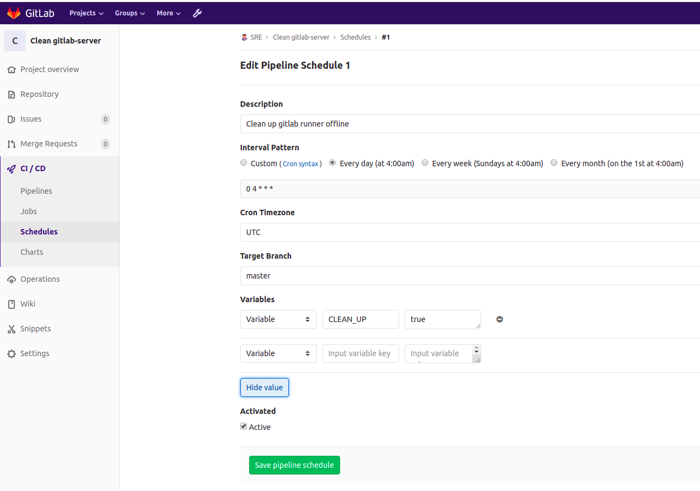

## Bạn có thể lập lịch chạy gitlab-CI
- Tình huống: Bạn muốn định kì lúc 4h sáng hàng ngày chạy 1 gitlab-ci để làm 1 việc gì đó. Cụ thể ở đây, mình viết gilab-ci để chạy 1 đoạn script xóa những runner đang có status offline. và `runner` được chạy phải có tags là `ci-general`

- Gitlab-CI config:

```
stages:
- you-say-run

run:clean-up-gitlab-runner:
  stage: you-say-run
  image: tekohub/curl
  script:
  - apk add --update bash
  - cd clean-up-gitlab-runner
  - ./clean-up-gitlab-runners-offline
  tags:
  - ci-general
  only:
    refs:
      - master
    variables:
      - $CLEAN_UP
```
- **Ý nghĩa đoạn gitlab-ci là:**
  - runner pull repo về, chạy đoạn script `clean-up-gitlab-runners-offline` khi và chỉ khi ở trên `master` brach và có variable truyền vào là `CLEAN_UP`. cụ thể xem hình bên dưới

- và lập lịch cho nó ở:



## Sử dụng api của Gitlab để thao tác
- Ví dụ như bạn muốn dùng API để xóa các runner có status là offline, bạn phải có key access token.

- Ví dụ script:

```
#!/bin/bash

while IFS= read -r tag;
do
    echo "### Clean up ci runners for tag $tag..."
    for gitlab_runner in $(curl -s "$GITLAB_SERVER/api/v4/runners/all?tag_list=$tag&status=offline&private_token=$GITLAB_TOKEN" | jq ".[]" -c)
    do
        echo "Clean up runner $gitlab_runner"
        runner_id=$(echo $gitlab_runner | jq '.id')
        echo "Remove offline runner $runner_id"
        curl -s "$GITLAB_SERVER/api/v4/runners/${runner_id}?private_token=$GITLAB_TOKEN" -X DELETE
    done
done < list_tags.txt
```
- `$GITLAB_TOKEN`, `$GITLAB_SERVER` được cái trong variables của CI/CD
