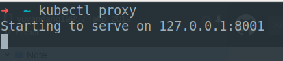
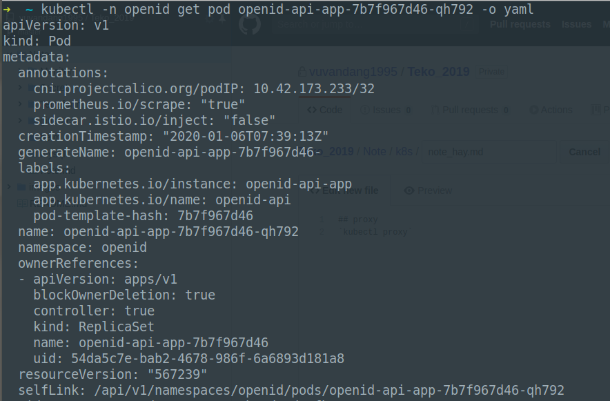
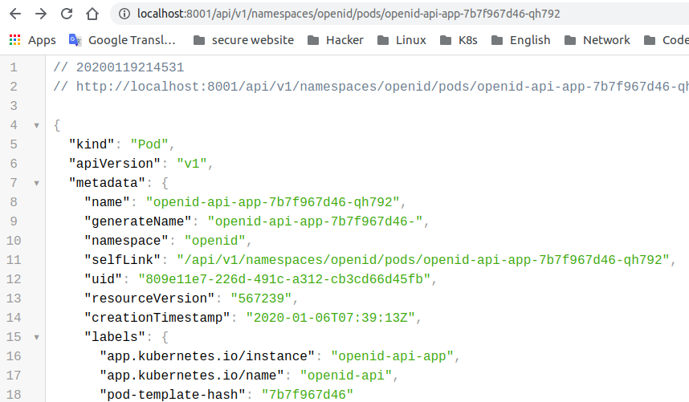
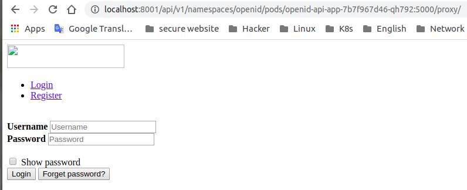
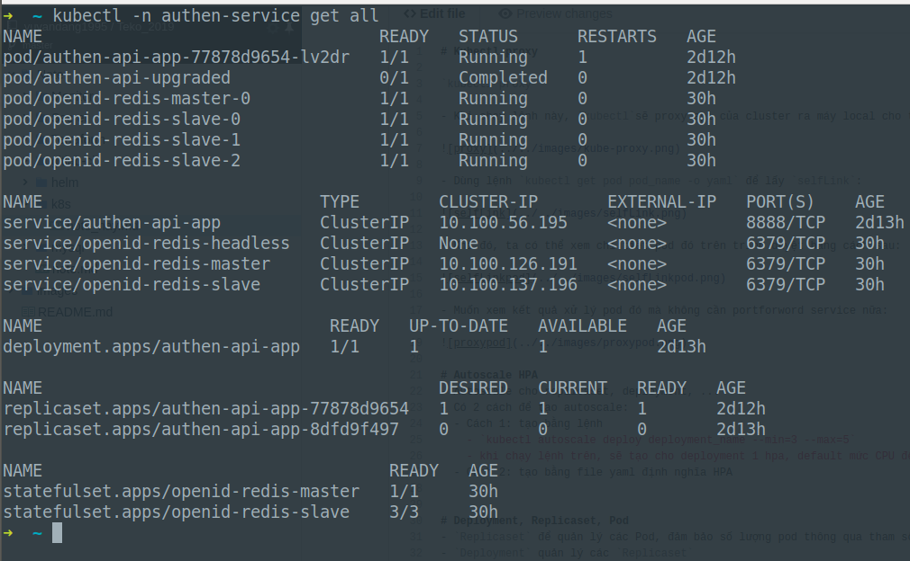
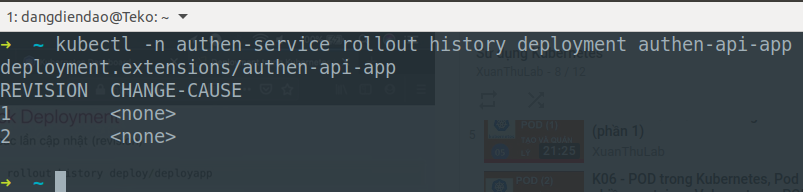
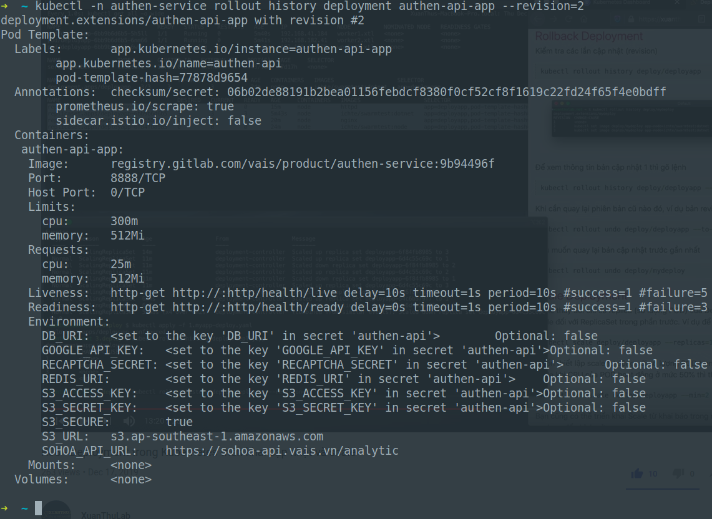
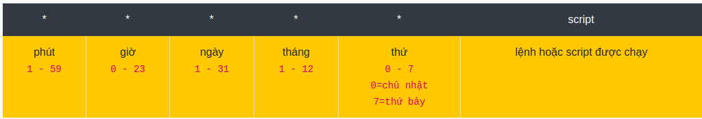

# Kubectl proxy

`kubectl proxy`

- Khi chạy lệnh này, `kubectl`sẽ proxy api của cluster ra máy local cho ta.



- Dùng lệnh `kubectl get pod pod_name -o yaml` để lấy `selfLink`:



- Khi đó, ta có thể xem chi tiết pod đó trên trình duyệt bằng cách sau: 



- Muốn xem kết quả xử lý pod đó mà không cần port-forward service nữa:



# Autoscale HPA
- Autoscale cho replicaset, deployment, ...
- Có 2 cách để tạo autoscale:
  - Cách 1: tạo bằng lệnh
    - `kubectl autoscale deploy deployment_name --min=3 --max=5`
    - khi chạy lệnh trên, sẽ tạo cho deployment 1 hpa, default mức CPU để scale là 80%
  - Cách 2: tạo bằng file yaml định nghĩa HPA
  
  
# Deployment, Replicaset, Pod
- `Replicaset`quản lý các `Pod`, nó đảm bảo số lượng các pod tồn tại trong 1 thời điểm thông qua tham số `replica: 3`
- `Deployment` quản lý các `replicaset`
- Khi tạo một `deployment`, nó sinh ra một `replicaset`tương ứng. 
- **Khi bạn update Deployment, nó sẽ sinh ra một bản Replicaset, tương ứng với những gì bạn update Deployemnt. Điểu này có nghĩa rằng, bạn có thể dựa vào số replicaset của Deployment đó, để biết số lần update, mỗi lần update cái gì, và có thể rollback lại tới bản replicaset nào bạn muốn**



- Xem lịch sử update `Deployment`:



- Xem chi tiết lần update đó :



- `rollback` `deployment` lại bản replicaset nào, dự vào `revision` của replicaset:

`kubectl -n authen-service rollout undo deployment authen-api-app --to-revision=2`

# DaemonSet
- `DaemonSet` **đảm bảo** nỗi `Worker Node`sẽ tồn tại một pod. Nghĩa là 1 Cluster có 3 `worker node`, khi bạn tạo 1 app có kind là `DaemonSet`, nó sẽ tạo ra 3 pod nằm trên mỗi `worker node`. Một số app dùng DaemonSet phổ biến như Loki, fluent-bit... để lấy logs trên tất cả các node... 

- 2 từ **Đảm bảo** của `ReplicaSet`, `DaemonSet` nghĩa là nếu pod bị xóa, nó sẽ tạo lại

# Job
- `Job` sẽ tạo Pod để hoàn thành một tác vụ nào đó. Nếu tác vụ thành công, nó báo hoàn thành và ngược lại. 
- `Job` thường được sử dụng trong trường hợp migrate database, backup data, kiểm tra gì đó.

```
apiVersion: batch/v1
kind: Job
metadata:
  name: myjob
spec:
  # Số lần chạy POD thành công
  completions: 10
  # Số lần tạo chạy lại POD bị lỗi, trước khi đánh dấu job thất bại
  backoffLimit: 3
  # Số POD chạy song song
  parallelism: 2
  # Số giây tối đa của JOB, quá thời hạn trên hệ thống ngắt JOB
  activeDeadlineSeconds: 120

  template:
    spec:
      containers:
      - name: busybox
        image: busybox
        command:
          - /bin/sh
          - -c
          - date; echo "Job executed"
      restartPolicy: Never
```

# CronJob
- `CronJob` tạo pod để chạy 1 tác vụ nào đó theo đúng lịch đề ra

```
apiVersion: batch/v1beta1
kind: CronJob
metadata:
  name: mycronjob
spec:
  # Một phút chạy một Job
  schedule: "*/1 * * * *"
  # Số Job lưu lại
  successfulJobsHistoryLimit: 3
  jobTemplate:
    spec:
      template:
        spec:
          containers:
          - name: busybox
            image: busybox
            args:
            - /bin/sh
            - -c
            - date; echo "Job in CronJob"
          restartPolicy: Never
```




