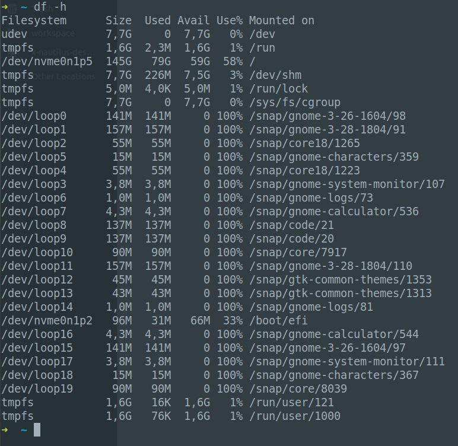

## Git submodules
- Sử dụng `git submodules` repo này có thể sử dụng repo khác.
- link: https://kipalog.com/posts/Lam-viec-voi-git-submodule

## circle ci validate config cli
- link: https://circleci.com/docs/2.0/local-cli/#quick-installation


## Teraform 
```
module "records__id-dev_teko_vn" {
  source  = "../../mod/records"
  zone_id = cloudflare_zone.default.id

  name = "id-dev.teko.vn"
  records = [
    {
      type    = "A"
      value   = "35.240.235.171"
      ttl     = "1"
      proxied = true
    },
  ]
}
```

- Nếu `proxied = true` nghĩa là có ssl, domain sẽ trỏ về ip của Cloudflare(thực chất vẫn trỏ về ip của mình định nghĩa kia, chỉ là giấu đi thôi)
- Nếu `proxied = false` nghĩa là k có ssl, domain sẽ trỏ thẳng về ip mình định nghĩa bên trên

## Hay hay nè



- Nhìn trong hình sẽ thấy cái dòng: `tmpfs           7,7G  226M  7,5G   3% /dev/shm` 
- `shm` viết tắt của share memory, nghĩa là nếu tạo 1 file trong thư mục đó, nó sẽ đc lưu trên memory(RAM), vì thế tốc độ đọc ghi rất là nhanh <3

## triển khai k8s thì có gì hay?
- Đứng trước k8s có `haprory` làm load balancing cho k8s (haproyx -> ingress): IP haproxy chính là đầu vào cho các `web app` (frontend)
- Đứng trước k8s còn có 1 cụm `Kong`: IP kong proxy chính là đầu vào cho các `Endpoint APIs` (backend)
## Triển khai app trong K8s
- Với các `Endpoint APIs` thì mới cần tạo `resource service`, cần có `health check`
- Còn với `web app`(frontend) và `celery` (worker) thì không cần tạo `resource service`, cần có `health check`

## Export env từ kết quả 1 câu lệnh khác
- export TAGS=Infras-`openssl rand -base64 8`

